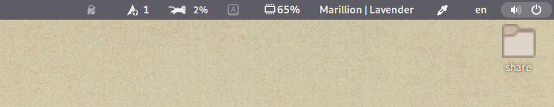
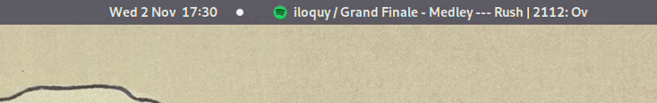

# sp-tray

sp-tray is a very simple GNOME Shell extension that displays current track information in the system tray using Spotify's dbus interface without involving the web API. There are no playback controls and/or album art display, and there never will be. This is intended to be nothing more than a simple label for Spotify only.

Example static text, on the right side without logo:  
  

Example marquee text, in the center of the status bar, with logo:  

## Features

- Shows the title, artist, album information, as well as playback modes. Allows you to customize how it's all shown. Can set separate display formats for podcasts and songs.

- Can show metadata either as a static label, or as a configurable, horizontally scrolling marquee

- Can choose which part of the top panel it will live in

- Uses Spotify's exposed dbus interface to fetch metadata, doesn't use the web API or require a premium account

- Works on Wayland as well as X

- Supports [ncspot](https://github.com/hrkfdn/ncspot)

## Installation

Preferably, you should:

[][extlink]

Alternatively, you could:

1. Clone this repo anywhere on your computer

2. Run the install script with `./<path_to_dir>/install.sh`. By default the files are copied into a new directory under `~/.local/share/gnome-shell/extensions/`.

3. Restart gnome-shell (xorg) and activate the extension via gnome-tweaks. Gnome-shell cannot be restarted under Wayland, so you may have to log out and back in.

The release version on the official Gnome website will be smaller in size and most likely most stable, but it might not be the most up-to-date version.

## Dependencies

- `libgtop` and gnome-tweaks as usual to load/install GNOME shell extensions.

## Reporting issues & bugs

Along with a quick description of the issue/bug, please also include:

- Your gnome-shell version

- Your spotify version

- Which package manager you got it from (Snap, Flatpak, AUR, whatever)

## Notes

- Not personally tested with any shell version older than 3.36 because I can't be bothered. If you have tested it and can confirm that it works, let me know.
    - As of version 18, support for Gnome versions <40 have been removed from the list of supported versions. The last release known to work with those version will be kept available on Gnome's website.

- English, German and Turkish translations are provided by me. If you'd like to contribute new translations, or improvements to existing ones, please contact me or better yet just make a PR.

- If you'd like to request support for your favorite 3rd party Spotify client, feel free to submit a feature request. I'll see what I can do, but no promises.

## License

GPLv2+

[extlink]: https://extensions.gnome.org/extension/4472/spotify-tray/
